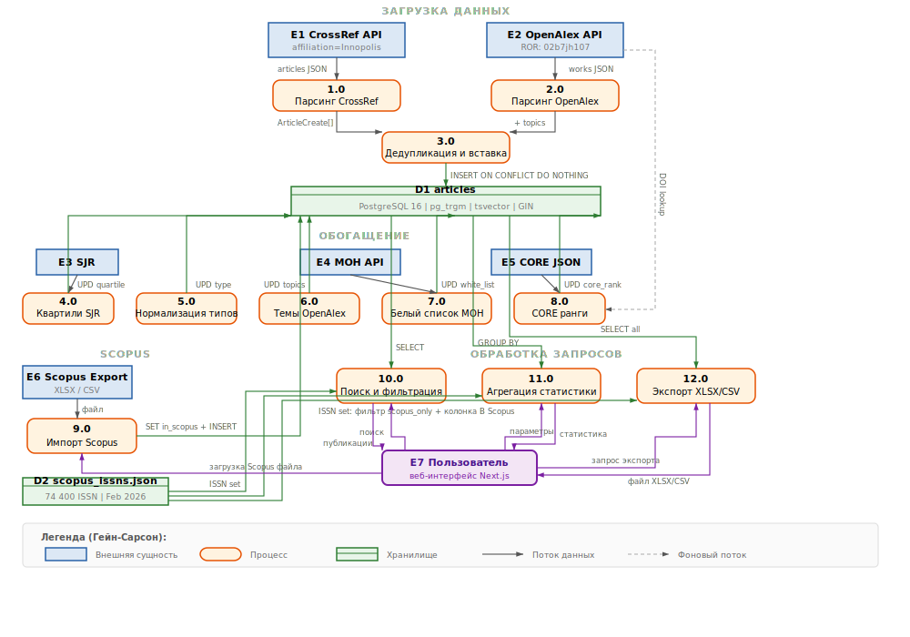

# Mon_pub -- Мониторинг публикационной активности


Платформа агрегации научных публикаций Университета Иннополис. Собирает статьи из **CrossRef** и **OpenAlex**, обогащает квартилями из рейтинга **SJR**, предоставляет веб-интерфейс для поиска, фильтрации и экспорта.

## Архитектура

```
┌─────────────┐     ┌──────────────┐     ┌────────────────┐
│  CrossRef   │────>│              │     │                │
│    API      │     │   Backend    │────>│  PostgreSQL    │
│             │     │  (FastAPI)   │     │  pg_trgm +     │
├─────────────┤     │              │     │  tsvector FTS  │
│  OpenAlex   │────>│  :8001       │     └────────────────┘
│    API      │     └──────┬───────┘
└─────────────┘            │
                           │ REST API
                    ┌──────┴───────┐
                    │   Frontend   │
                    │  (Next.js)   │
                    │  :3000       │
                    └──────────────┘
```

| Компонент | Стек |
|-----------|------|
| Backend | Python 3.12, FastAPI, SQLAlchemy 2.0 (async), Alembic, httpx, tenacity, openpyxl |
| Frontend | Next.js 14, React 18, Tailwind CSS, TypeScript |
| База данных | PostgreSQL 16 с расширениями `pg_trgm` (нечёткий поиск) и `tsvector` (stemming) |
| Данные SJR | CSV из [SCImago Journal Rank](https://www.scimagojr.com/) |

## Диаграммы

Диаграммы доступны в форматах SVG и PDF в директории [`diagrams/`](diagrams/).

### ERD (Entity-Relationship Diagram)



### DFD (Data Flow Diagram)



> PDF-версии: [ERD (PDF)](diagrams/erd.pdf) | [DFD (PDF)](diagrams/dfd.pdf)

## Быстрый старт

### Требования

- Docker и Docker Compose

### Запуск

```bash
# 1. Клонировать репозиторий
git clone https://github.com/sevarus23/Mon_pub.git
cd Mon_pub

# 2. Настроить переменные окружения
cp backend/.env.template backend/.env

# 3. Запустить backend + БД
cd backend
docker compose up -d

# 4. Запустить frontend (в отдельном терминале)
cd ../frontend
npm install
npm run dev
```

После запуска:
- **API**: http://localhost:8001
- **Swagger UI**: http://localhost:8001/docs
- **Frontend**: http://localhost:3000

## API

| Метод | Эндпоинт | Описание |
|-------|----------|----------|
| GET | `/api/articles` | Список статей с фильтрами, поиском, topic и пагинацией |
| GET | `/api/articles/{id}` | Статья по ID |
| GET | `/api/articles/stats` | Статистика: всего, по годам, по источникам, топ журналов |
| GET | `/api/articles/export` | Экспорт в XLSX/CSV с текущими фильтрами |
| GET | `/api/articles/openalex-search` | Глобальный поиск OpenAlex с фильтром по институции |
| GET | `/api/articles/journals` | Список журналов (с fuzzy search) |
| GET | `/api/articles/authors` | Список авторов (с fuzzy search) |
| GET | `/api/articles/types` | Типы публикаций |
| GET | `/api/articles/topics` | Темы публикаций (с fuzzy search) |
| GET | `/api/articles/quartiles` | Доступные квартили |
| POST | `/api/articles/parse` | Запуск парсинга CrossRef + OpenAlex |
| POST | `/api/articles/update-quartiles` | Обновление квартилей из SJR CSV |
| POST | `/api/articles/normalize-types` | Нормализация типов статей |
| POST | `/api/articles/backfill-topics` | Обогащение существующих статей темами из OpenAlex |
| GET | `/api/articles/sources-table` | Таблица источников (журналы с Scopus/Белый список) |
| GET | `/api/articles/conferences-table` | Таблица конференций с CORE рангами |
| POST | `/api/articles/update-white-list` | Обновление уровней Белого списка МОН РФ |
| POST | `/api/articles/update-core-ranks` | Обновление CORE рангов конференций |
| GET | `/health` | Проверка состояния сервиса |

### Параметры фильтрации `GET /api/articles`

`search`, `journal_name`, `author`, `title`, `doi`, `issn`, `date_from`, `date_to`, `year`, `quartile`, `article_type`, `topic`, `source`, `scopus_only`, `white_list_only`, `core_rank`, `sort_by`, `sort_order`, `page`, `per_page`

### Параметры экспорта `GET /api/articles/export`

Все параметры фильтрации (кроме `page`/`per_page`) + `format` (`xlsx` или `csv`). Лимит: 10 000 записей.

## Тестирование

### Backend (174 тестов)

```bash
cd backend
pip install -r requirements-test.txt
pytest tests/ -v
```

| Уровень | Что проверяется | Кол-во |
|---------|----------------|--------|
| `tests/unit/` | Чистые функции: парсинг, маппинг типов, SJR CSV, Pydantic-схемы, экспорт, topics, white list | 135 |
| `tests/api/` | Контракт HTTP-эндпоинтов (статус-коды, валидация, экспорт, topics, institution, white list, CORE) | 32 |
| `tests/service/` | Логика сервисов с мокированием HTTP через respx | 17 |

### Frontend (31 тест)

```bash
cd frontend
npm install
npm test
```

Тестируются утилитные функции: `getTypeLabel`, `getQuartileClass`, `isNewToday`, `formatDate`, `buildQuery`, `getExportUrl`.

## CI/CD

GitHub Actions автоматически запускает все тесты на каждый push и pull request в `main`.

Branch Protection настроен так, что **мерж в main невозможен**, если хотя бы один тест не проходит.

## Версионирование

Проект использует [Semantic Versioning](https://semver.org/). Все релизы доступны на [GitHub Releases](https://github.com/sevarus23/Mon_pub/releases).

| Версия | Дата | Ключевое |
|--------|------|----------|
| [v2.0.0](https://github.com/sevarus23/Mon_pub/releases/tag/v2.0.0) | 2026-04-05 | Белый список МОН, CORE Rankings, вкладки Источники/Конференции, UI/UX polish |
| [v1.4.0](https://github.com/sevarus23/Mon_pub/releases/tag/v1.4.0) | 2026-04-05 | Экспорт XLSX/CSV, topics/keywords, stemming, institution search, autocomplete |
| [v1.3.0](https://github.com/sevarus23/Mon_pub/releases/tag/v1.3.0) | 2026-04-01 | Глобальный поиск OpenAlex |
| [v1.2.0](https://github.com/sevarus23/Mon_pub/releases/tag/v1.2.0) | 2026-04-01 | Фильтр Scopus (71k ISSN) |
| [v1.1.0](https://github.com/sevarus23/Mon_pub/releases/tag/v1.1.0) | 2026-04-01 | CI/CD пайплайн, автодеплой |
| [v1.0.0](https://github.com/sevarus23/Mon_pub/releases/tag/v1.0.0) | 2026-03-31 | Первый релиз: парсинг, поиск, фильтры, дизайн IU |

## Структура проекта

```
Mon_pub/
├── backend/
│   ├── app/
│   │   ├── config.py          # Настройки (Pydantic Settings)
│   │   ├── database.py        # Async SQLAlchemy engine
│   │   ├── main.py            # FastAPI app + scheduler
│   │   ├── models/            # SQLAlchemy модель Article
│   │   ├── repositories/      # Слой доступа к данным
│   │   ├── routers/           # HTTP-эндпоинты
│   │   ├── schemas/           # Pydantic-схемы
│   │   ├── services/          # CrossRef, OpenAlex, SJR, Export, Topics, White List, CORE, Scheduler
│   │   └── utils/             # Маппинг типов, Scopus ISSN
│   ├── alembic/versions/      # Миграции БД (001–005)
│   ├── data/                  # SJR CSV, Scopus ISSN, White List cache, CORE ranks
│   ├── tests/                 # Тесты (unit, api, service)
│   └── requirements.txt
├── frontend/
│   ├── app/                   # Next.js страницы
│   ├── components/            # React-компоненты (Autocomplete, SourcesTable, ConferencesTable)
│   ├── lib/                   # API-клиент
│   ├── types/                 # TypeScript типы + утилиты
│   └── __tests__/             # Jest тесты
├── diagrams/                  # ERD и DFD (SVG, PDF, Mermaid)
├── .github/workflows/         # CI/CD пайплайн
├── docker-compose.yml
└── testplan.md                # Полный тест-план проекта
```
